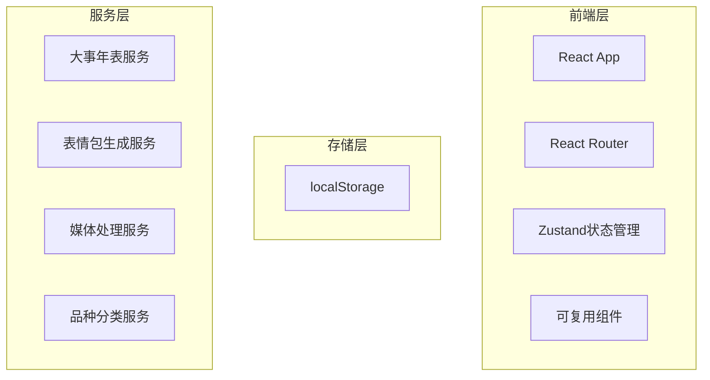
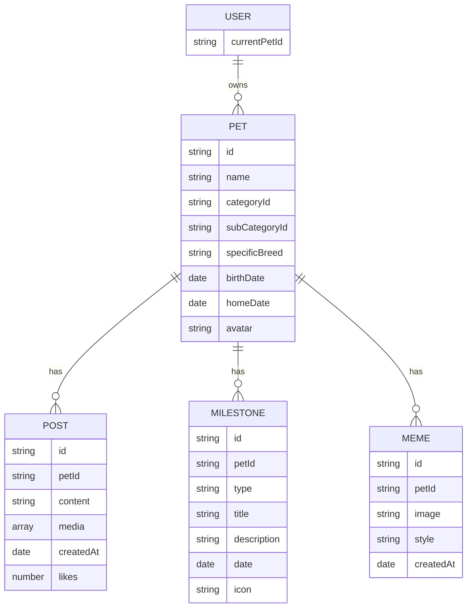

## 1. Architecture Design


## 2. Technology Description
- 前端：React@18 + TypeScript + TailwindCSS@3 + Vite
- 初始化工具：vite-init
- 后端：无（使用localStorage进行数据持久化）
- 状态管理：Zustand
- 路由：React Router
- 图标：lucide-react
- 其他：canvas处理图片和表情包生成

## 3. Route Definitions
| Route | Purpose |
|-------|---------|
| / | 首页 - 动态流页面（支持多宠物切换） |
| /timeline | 大事年表页面 |
| /meme | 表情包生成页面 |
| /pets | 宠物管理页面 |

## 4. Data Model

### 4.1 Data Model Definition


### 4.2 TypeScript Interfaces

```typescript
// 品种分类树
interface BreedCategory {
  id: string;
  name: string;
  icon: string;
  subCategories: {
    id: string;
    name: string;
    specificBreeds: string[];
  }[];
}

interface Pet {
  id: string;
  name: string;
  categoryId: string;
  subCategoryId?: string;
  specificBreed?: string;
  birthDate: string;
  homeDate: string;
  avatar?: string;
}

interface Post {
  id: string;
  petId: string;
  content: string;
  media: string[];
  createdAt: string;
  likes: number;
}

interface Milestone {
  id: string;
  petId: string;
  type: 'home' | 'vaccine' | 'deworm' | 'bath' | 'neuter' | 'anniversary' | 'custom';
  title: string;
  description?: string;
  date: string;
  icon: string;
}

interface Meme {
  id: string;
  petId: string;
  image: string;
  style: string;
  createdAt: string;
}
```

## 5. File Structure
```
/workspace
├── src/
│   ├── components/
│   │   ├── PostCard.tsx
│   │   ├── MilestoneItem.tsx
│   │   ├── PetSelector.tsx
│   │   ├── PetCard.tsx
│   │   └── BottomNav.tsx
│   ├── pages/
│   │   ├── Home.tsx
│   │   ├── Timeline.tsx
│   │   ├── Meme.tsx
│   │   └── Pets.tsx
│   ├── hooks/
│   │   └── usePetStore.ts
│   ├── utils/
│   │   ├── storage.ts
│   │   ├── memeGenerator.ts
│   │   └── breedData.ts
│   ├── types.ts
│   ├── App.tsx
│   └── main.tsx
├── package.json
└── vite.config.ts
```
