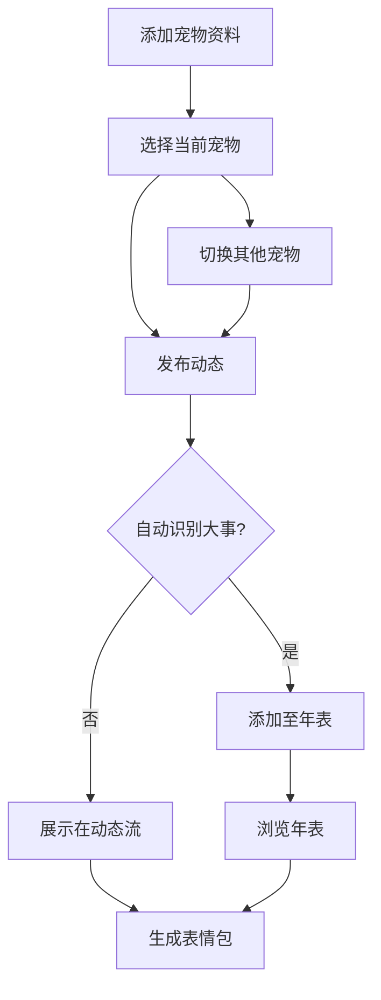

## 1. Product Overview
宠物记录网页应用，帮助用户记录和分享多只宠物成长的点滴，自动生成大事年表和表情包。
- 主要用途：记录多只宠物照片、视频、文字，追踪重要里程碑，生成趣味表情包
- 目标用户：宠物爱好者、养宠家庭（可能养多只不同品种的宠物）
- 市场价值：提供情感化的宠物记录体验，简化成长追踪，支持多宠物管理

## 2. Core Features

### 2.1 User Roles
| Role | Registration Method | Core Permissions |
|------|---------------------|------------------|
| Normal User | Local storage (demo) | 完整使用所有功能 |

### 2.2 Feature Module
1. **首页（动态流）**：类似朋友圈的动态展示，支持切换宠物，发布新动态
2. **宠物管理**：添加、编辑、切换多只宠物，按品种分类
3. **大事年表**：自动生成和展示当前宠物重要里程碑
4. **表情包生成**：上传宠物照片，自动生成表情包
5. **宠物信息**：管理每只宠物的详细资料，包含品种树状分类

### 2.3 Page Details
| Page Name | Module Name | Feature description |
|-----------|-------------|---------------------|
| 首页（动态流） | 发布功能 | 上传照片/视频，添加文字描述，发布动态，关联当前宠物 |
| 首页（动态流） | 动态列表 | 卡片式展示动态，支持查看所有宠物或单只宠物，时间线排列 |
| 首页（动态流） | 宠物切换 | 顶部快速切换当前宠物，或查看全部动态 |
| 宠物管理 | 宠物列表 | 展示所有宠物卡片，支持添加新宠物，点击切换 |
| 大事年表 | 自动生成 | 根据发布内容自动识别和创建里程碑（到家、疫苗、驱虫等） |
| 大事年表 | 手动添加 | 用户可手动添加重要事件 |
| 表情包生成 | 图片上传 | 上传宠物照片，选择表情风格，生成表情包 |
| 宠物信息 | 资料管理 | 设置宠物名字、品种（树状分类）、生日等基本信息 |

## 3. Core Process
用户打开应用 → 选择/添加宠物 → 发布动态（照片/文字）→ 系统自动识别大事 → 浏览年表和生成表情包 → 随时切换宠物记录

## 4. User Interface Design
### 4.1 Design Style
- 主色调：温暖的落日黄（#F59E0B），搭配柔和的奶油背景（#FEFCE8）
- 辅助色：温暖的橘红色（#EA580C）用于强调，搭配浅棕色（#92400E）
- 按钮风格：圆角矩形，轻微阴影，悬停有缩放效果
- 字体：Noto Sans SC（中文）+ Nunito（英文），标题24px，正文16px
- 布局风格：卡片式设计，顶部宠物切换栏，底部标签栏
- 图标风格：简约线性图标，来自lucide-react

### 4.2 Page Design Overview
| Page Name | Module Name | UI Elements |
|-----------|-------------|-------------|
| 首页（动态流） | 宠物切换 | 顶部横向滚动的宠物头像栏，支持快速切换，含"全部"选项 |
| 首页（动态流） | 发布区 | 固定在顶部，包含输入框、媒体上传按钮、发布按钮 |
| 首页（动态流） | 动态卡片 | 白色背景，圆角8px，底部阴影，图片区域4:3比例，显示宠物头像和名字 |
| 宠物管理 | 宠物卡片 | 网格布局展示所有宠物，带添加按钮，点击切换或编辑 |
| 大事年表 | 时间线 | 垂直时间线，彩色标记，事件卡片交错排列 |
| 表情包生成 | 生成区域 | 左侧上传预览，右侧风格选择，底部生成按钮 |

### 4.3 Responsiveness
- 移动端优先设计，适配320px-1920px屏幕
- 底部导航在移动端固定，桌面端移至侧边
- 图片和内容自适应布局，触摸交互优化
- 宠物切换栏在桌面端可显示更多头像
