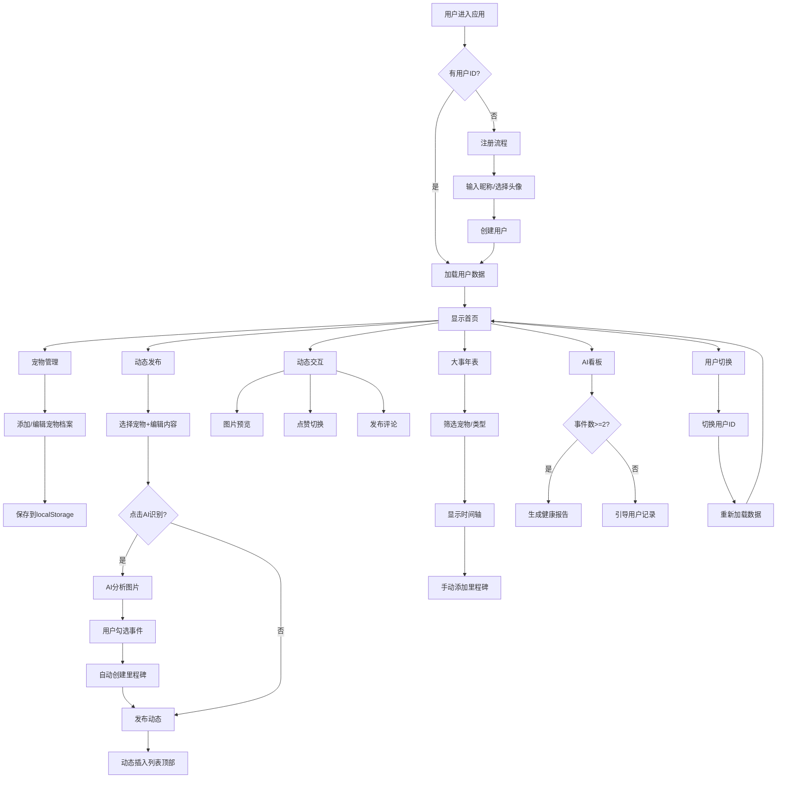
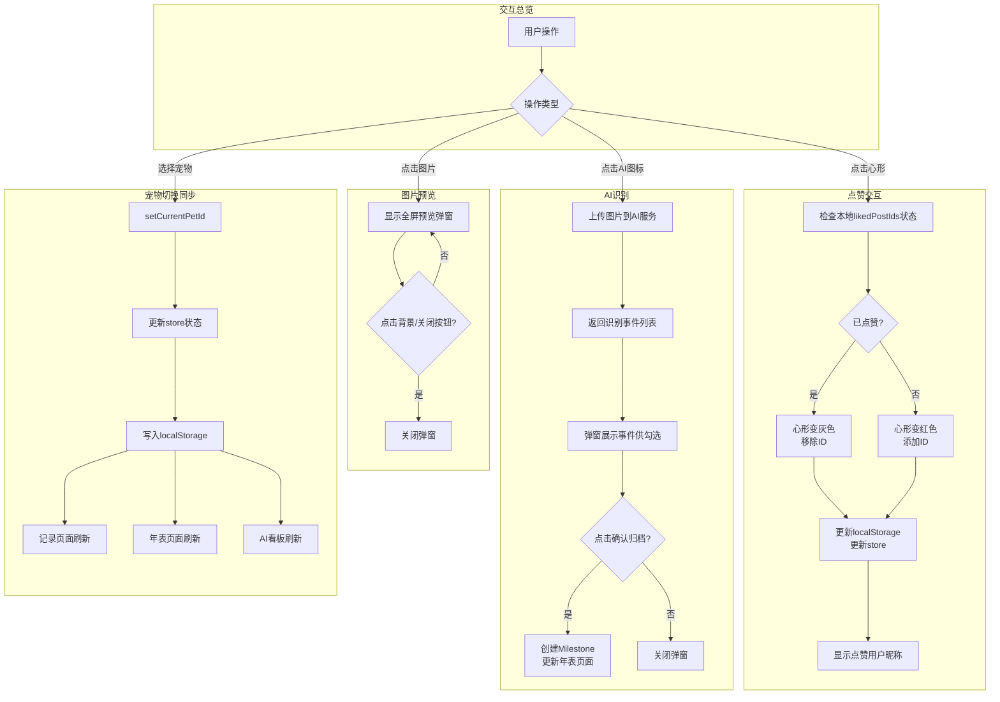

# 宠物记录应用 PRD

**版本**：V1.0
**编写人**：产品团队
**编写日期**：2026-06-15

---

## 1. 需求背景

### 1.1 记录宠物生活

宠物已成为现代家庭的重要成员，但宠物主人往往缺乏系统化的生活记录工具。日常点滴（如喂食、遛弯、洗澡）和关键事件（如疫苗接种、驱虫、就医）分散在不同的平台和笔记中，难以形成完整的时间线和历史追溯。本需求通过"动态+里程碑"双轨记录模式，让主人可随手记录宠物的日常点滴，并将重要健康事件沉淀为可追溯的时间轴档案。

### 1.2 关注健康管理

宠物的健康状态需要长期追踪才能发现异常。传统的纸质疫苗本容易丢失，体重变化缺乏趋势感知，驱虫时间遗忘导致健康风险。本需求通过"大事年表+AI看板"的组合，系统沉淀疫苗、驱虫、体重等健康数据，并自动分析健康评分和风险提示，让主人像掌握自己健康数据一样掌握宠物的健康状态。

### 1.3 提升情感陪伴

记录宠物生活不仅仅是信息管理，更是情感的沉淀与分享。动态的点赞、评论互动，让主人在宠物社区中获得共鸣；里程碑的完整时间线，在宠物生日或特殊纪念日时可回顾宠物的成长故事。本需求将记录行为转化为情感价值，让每一次记录都有情感回报。

---

## 2. 需求概述

本需求围绕"宠物生活记录与健康管理"构建一套轻量级的移动端应用，核心包含**用户注册、宠物档案管理、动态发布与互动、大事年表记录、AI健康分析看板**五大模块。

**核心逻辑**：
1. 用户进入应用后完成注册，创建/添加一只或多只宠物的档案资料
2. 在"记录"页面发布宠物日常动态（文字+图片），动态支持点赞和评论互动
3. 在"大事年表"页面手动添加宠物的关键事件（疫苗、驱虫、体重、就医等），动态中的图片也可通过AI识别自动归档为里程碑
4. 在"AI看板"页面查看系统对宠物健康状态的自动分析报告
5. 所有数据存储在本地，支持多用户切换和跨页面实时同步

**业务流程图（Mermaid）**：

---

## 3. 优先级划分

| 优先级 | 模块名称 | 子需求 | 核心价值 | 建议周期 |
| :--- | :--- | :--- | :--- | :--- |
| **P0 最高** | 用户注册与登录 | 昵称输入、头像选择、用户创建 | 应用进入第一道门槛，确保用户可进入应用 | 0.5 天 |
| **P0 最高** | 宠物档案管理 | 宠物增删改查、种类/性别/生日设置、资料卡展示 | 所有后续功能的数据基础，核心实体 | 1 天 |
| **P0 最高** | 动态发布 | 文字+图片发布、宠物筛选、动态列表展示 | 核心记录功能，用户高频使用场景 | 1.5 天 |
| **P1 高** | 动态交互 | 图片放大预览、点赞/取消点赞、评论发布与展示 | 提升用户停留和情感价值 | 1 天 |
| **P1 高** | 大事年表（手动） | 里程碑增删改查、类型筛选、时间轴展示 | 健康记录的核心载体 | 1 天 |
| **P1 高** | 跨页面宠物同步 | 切换宠物后所有页面数据实时刷新 | 确保多宠物用户的使用流畅性 | 0.5 天 |
| **P2 中** | AI识别归档 | 动态图片AI识别健康事件、用户确认后自动创建里程碑 | 降低手动记录门槛，提升里程碑创建效率 | 1 天 |
| **P2 中** | AI健康看板 | 健康评分、体重趋势、疫苗/驱虫状态分析、健康建议 | 核心差异化功能，体现应用价值 | 1 天 |
| **P3 低** | 多用户切换 | 账号切换、数据隔离、独立存储 | 多用户家庭使用场景 | 0.5 天 |
| **P3 低** | UI/UX 优化 | 弹窗层级优化、图片尺寸适配、点赞状态即时响应 | 使用体验打磨，降低用户流失 | 持续优化 |

---

## 4. 需求详情

### 4.1 交互逻辑 / AI需求

**核心交互流程图（Mermaid）**：

**核心交互要点**：

| 交互场景 | 原型示意要点 | 关键行为 |
| :--- | :--- | :--- |
| 点赞 | 心形图标（灰→红切换），旁边显示点赞用户昵称 | 点击即切换，不等待接口返回，本地状态先响应 |
| 图片预览 | 白色背景居中展示图片，尺寸不超出屏幕，支持点击背景关闭 | z-index 高于底部导航栏，居中显示 |
| AI识别弹窗 | 居中展示识别出的事件列表（疫苗/驱虫/洗澡等），用户可勾选，"确认归档"按钮在底部 | 弹窗 z-index=51，不被导航栏遮挡 |
| 宠物切换 | 顶部/筛选栏下拉框选择宠物名称，所有页面数据同步刷新 | 通过 store.currentPetId 实现状态同步 |
| 用户切换 | 顶部用户头像点击 → 用户列表 → 选择目标用户 → 页面整体刷新 | 调用 loadData() 重新加载该用户全量数据 |

---

### 4.2 功能详情

#### 4.2.1 页面逻辑（用户动线）

| 模块/页面 | 用户动作 | 页面行为 | 数据变化 |
| :--- | :--- | :--- | :--- |
| 注册页面 | 进入应用 | 检查 localStorage.currentUserId | 若无→展示注册页；若有→直接跳转首页 |
| 注册页面 | 输入昵称+选择头像+点击确认 | 创建用户对象，写入 localStorage.users 和 currentUserId | users 数组新增1条，currentUserId 设置 |
| 首页 | 进入首页 | 展示宠物资料卡入口、动态列表入口、年表入口、看板入口 | 读取 store.pets、posts、milestones 状态 |
| 我的页面 | 点击资料卡或"+添加宝贝" | 进入宠物资料编辑表单 | 添加模式：创建新Pet对象；编辑模式：更新已有对象 |
| 记录页面 | 选择宠物筛选+输入文字+添加图片+点击发布 | 动态列表顶部插入新动态 | posts 数组新增1条，post.petId=当前选中宠物 |
| 记录页面 | 点击动态图片 | 全屏预览图片弹窗展示 | 无数据变化，纯前端交互 |
| 记录页面 | 点击动态心形图标 | 心形颜色切换，点赞数变化 | likedPostIds 本地 Set 更新，post.likes 数组更新 |
| 记录页面 | 输入评论+点击发送 | 评论插入动态底部 | post.comments 数组新增1条 |
| 大事年表页面 | 选择宠物/类型筛选 | 时间轴按条件过滤重新渲染 | 前端 useMemo 计算过滤结果，无后端变化 |
| 大事年表页面 | 点击"+"按钮+填写表单+保存 | 新里程碑插入时间轴顶部 | milestones 数组新增1条 |
| AI看板页面 | 进入页面 | 根据当前宠物里程碑数量决定展示报告或引导提示 | 前端计算统计，无数据写入 |
| 全局 | 点击顶部用户头像+选择用户 | 整体刷新为该用户的数据 | currentUserId 更新，loadData() 重新加载 |

#### 4.2.2 前后端交互逻辑

| 模块 | 功能 | 具体内容 | 存储键名 |
| :--- | :--- | :--- | :--- |
| 用户管理 | 创建用户 | 生成 id=Date.now().toString()，记录 name、avatar、createdAt | petTracker_users、petTracker_currentUserId |
| 用户管理 | 用户切换 | 根据 selectedUserId 从 users 中获取用户信息并设置为当前用户，重新加载数据 | petTracker_currentUserId |
| 宠物管理 | 添加宠物 | 生成 petId，关联 userId，记录 species、gender、birthday、arrivalDate、avatar | petTracker_pets |
| 宠物管理 | 设置当前宠物 | 更新 store.currentPetId 和 currentPet 对象，写入 localStorage | petTracker_currentPetId |
| 动态发布 | 发布动态 | 生成 postId，关联 petId 和 authorUserId，记录 content、media[]、comments[]、likes[] | petTracker_posts |
| 动态交互 | 点赞切换 | 判断 likedPostIds 中是否存在该 postId，存在则移除，不存在则添加；同时更新 post.likes 数组 | petTracker_posts（内嵌 likes 字段） |
| 动态交互 | 发布评论 | 生成 commentId，关联 postId 和 authorUserId，记录 content、createdAt | petTracker_posts（内嵌 comments 字段） |
| 大事年表 | 添加里程碑 | 生成 milestoneId，关联 petId 和 authorUserId，记录 type、title、description、date、metrics、isAI | petTracker_milestones |
| AI识别 | 从动态归档 | 用户勾选AI识别出的事件后，以 isAI=true 创建里程碑，petId 取动态关联宠物 | petTracker_milestones（isAI=true） |
| AI看板 | 健康报告 | 读取当前宠物里程碑，过滤健康相关类型，统计评分和趋势（纯前端计算） | 只读操作 |
| 初始化 | loadData | 应用启动时从 localStorage 读取所有6个键的数据，批量更新 Zustand store | 所有键名 |

#### 4.2.3 LLM / AI 交互逻辑

| AI能力 | 触发时机 | 输入 | AI处理 | 输出 / 用户操作 | 写入数据 |
| :--- | :--- | :--- | :--- | :--- | :--- |
| 图片事件识别 | 动态发布时点击"AI识别"图标 | 动态中的图片文件 | LLM多模态分析图片内容，识别健康相关事件（疫苗接种卡、驱虫药、体重秤、就医场景等） | 弹窗展示识别出的事件列表，用户勾选目标事件并确认归档 | 创建 isAI=true 的 Milestone 记录 |
| 健康报告生成 | 进入AI看板页面且事件数>=2 | 当前宠物的 milestones 列表 | LLM基于里程碑数据进行健康评估：疫苗完整性、驱虫频率、体重变化趋势、就医频次分析 | 生成健康评分+趋势分析+健康建议+历史摘要 | 不写入，纯前端展示 |

### 4.3 埋点需求（如有）

| 页面 | 事件名 | 触发时机 | 关键参数 | 用途 |
| :--- | :--- | :--- | :--- | :--- |
| 注册页 | register_click | 点击"确认注册" | has_avatar | 分析头像选择率 |
| 我的页面 | pet_add_click | 点击"+添加宝贝" | - | 统计宠物新增趋势 |
| 我的页面 | pet_save_click | 点击宠物资料"保存" | species、gender | 分析宠物种类分布 |
| 记录页面 | post_publish_click | 点击"发布" | has_image、image_count、has_ai_event | 分析动态发布行为和AI使用率 |
| 记录页面 | ai_recognize_click | 点击"AI识别"图标 | image_count | AI功能点击率 |
| 记录页面 | ai_archive_click | 点击"确认归档" | event_type_count | AI识别后实际归档率 |
| 记录页面 | like_toggle | 点击心形图标 | action_type(like/unlike) | 分析互动活跃度 |
| 记录页面 | comment_publish | 点击评论"发送" | comment_length | 分析评论互动深度 |
| 大事年表 | milestone_add | 点击里程碑"保存" | event_type | 各类型事件记录频率 |
| AI看板 | insights_view | 进入AI看板页面 | health_score_level | 看板使用率和健康评分分布 |
| 全局 | user_switch | 切换用户 | user_count | 多账号使用频率 |

---

## 5. 关键验收点

### 5.1 核心功能验收

| 编号 | 验收场景 | 预期结果 | 优先级 |
| :--- | :--- | :--- | :--- |
| A01 | 新用户进入应用 → 输入昵称 → 点击确认注册 | 成功创建用户并跳转首页，再次打开应用直接进入（不重复注册） | P0 |
| A02 | 添加第一只宠物（填写必填项后保存） | 宠物资料卡展示在"我的"页面，其他页面可筛选到该宠物 | P0 |
| A03 | 发布动态（含文字+图片） | 动态插入列表顶部，刷新后数据不丢失 | P0 |
| A04 | 点赞动态 → 再次点击取消点赞 | 心形颜色即时切换（红↔灰），点赞状态持久化，刷新后保持 | P0 |
| A05 | 大事年表手动添加里程碑（疫苗/驱虫/体重等） | 新里程碑按时间倒序正确显示在时间轴上 | P0 |
| A06 | 跨页面切换宠物 | 切换后记录页面/年表/看板数据实时刷新，不出现旧宠物数据 | P0 |

### 5.2 UI/UX 关键验收

| 编号 | 验收场景 | 预期结果 | 优先级 |
| :--- | :--- | :--- | :--- |
| B01 | 点击动态图片放大预览 | 图片以白色背景居中展示，尺寸不超出手机屏幕，不出现黑边或被遮挡 | P1 |
| B02 | 点赞/取消点赞操作 | 点击后心形颜色立即切换（不超过200ms），不会出现点击后无视觉反馈的情况 | P1 |
| B03 | 打开AI识别弹窗 / 添加里程碑弹窗 | 弹窗居中显示，不被底部导航栏遮挡（z-index 高于导航栏） | P1 |
| B04 | 大事年表中某宠物的里程碑与其他宠物里程碑混在一起 | 选择某宠物筛选后，仅显示该宠物的里程碑，不出现其他宠物里程碑 | P0 |

### 5.3 数据与逻辑正确性验收

| 编号 | 验收场景 | 预期结果 | 优先级 |
| :--- | :--- | :--- | :--- |
| C01 | 用户切换（已注册多个账号） | 切换后只展示目标用户的宠物/动态/里程碑，数据完全隔离，不会混入其他用户数据 | P1 |
| C02 | AI看板在事件数不足2条时 | 显示引导提示文案，不报错；当事件数>=2时自动生成健康报告 | P2 |
| C03 | AI识别归档后的里程碑 | 在大事年表中能看到 isAI=true 的事件，且 petId 正确关联到发布动态的宠物 | P2 |
| C04 | 关闭应用后重新打开 | 所有历史数据（用户、宠物、动态、里程碑、当前选中宠物）完整恢复 | P0 |
| C05 | 评论发布后 | 评论显示在动态底部，评论数实时更新，刷新后数据保留 | P1 |

### 5.4 边界场景验收

| 编号 | 验收场景 | 预期结果 | 优先级 |
| :--- | :--- | :--- | :--- |
| D01 | 动态发布时未输入文字且未上传图片 | 点击"发布"时给出提示，不创建空动态 | P1 |
| D02 | 无任何数据的新用户进入AI看板 | 显示空状态引导文案（如"还没有任何记录哦～"），页面不崩溃 | P2 |
| D03 | 上传超过9张图片 | 超出部分不允许添加，给出"最多9张图片"提示 | P3 |
| D04 | 大事年表选择类型筛选为"全部"+选择宠物筛选为"全部" | 展示所有宠物的所有里程碑，不出现数据遗漏或重复 | P0 |
| D05 | 点赞用户数超过3个 | 显示"用户A、用户B、用户C 等N人"，不溢出UI | P3 |

---

**文档结束**
